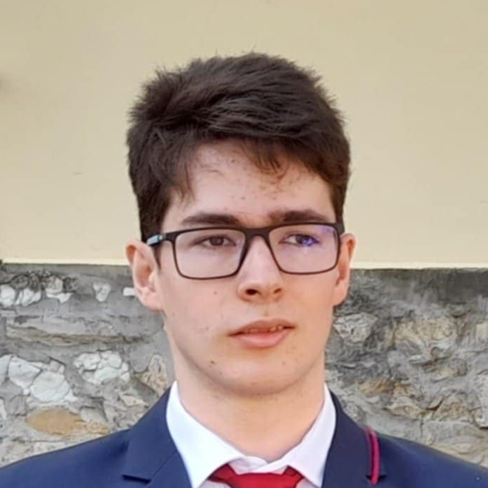

+++
date = '2026-08-21T21:30:49+02:00'
draft = false
title = 'Kik vagyunk?'
+++

## Az Open Space csapat tagjai:

- Autizmus spektrum pedagógiája szakirányos gyógypedagógusok
- Tanulásban akadályozottak pedagógiája szakirányos gyógypedagógusok
- Pszichológusok 
- Pár és Családterápiás szakemberek
- Pedagógusok
- Autogén tréner
- Mentálhigiénés szakember
- Művészetterapeuták
- és Terápiás segítő macska 

{{- < circle-img-begin > -}}

|      |      |      |
| :-----------------------: | :-----------------------: | :-----------------------: |
|     Gyógypedagógus 1      |     Pszichológus       |      Családterapeuta      |
|   |   |   |
|     Művészetterapeuta     |     Terápiás kutya :)     |     Gyógypedagógus 2      |
{{- < circle-img-end > -}}

Mint ahogy látható, táblázatok segítségével is lehet layout-szerűséget építeni *(habár ez nem annyira tanácsos, mert nagyon merev lesz a layout...)*
### Részletes bemutatkozások hamarosan! :-))
